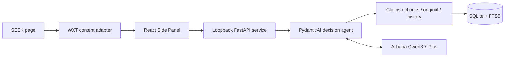

# Kiwi Career Copilot

> A local-first Chrome career agent for SEEK that investigates source-grounded evidence across multiple CVs and career documents.

Kiwi Career Copilot began as a browser extension for my own job search after moving to New Zealand. V1 improved SEEK search results and reached the Chrome Web Store. V2 adds a Career Library and an AI agent that can decide what personal evidence to investigate, how deeply to retrieve it and when clarification is actually useful.

This repository is an active V2 product milestone, not a finished commercial service. The Agent and Career Library slice works end to end; the persistent job workspace and full CV/material editor remain future product stages.

## Why I built it

I arrived in New Zealand as an international student and used SEEK for the first time while looking for part-time work. I had not updated my CV for years and had never needed to write a cover letter in my previous job searches in China. I also had several CVs for different purposes, plus visa conditions, a university timetable and project evidence spread across files.

The difficult part was not generating more text. It was repeatedly deciding whether a role was realistic, finding trustworthy evidence for its requirements and adapting an application without inventing experience.

## From a shipped extension to an agent

### V1 — SEEK search enhancement

The published first version adds negative filters, hidden/viewed job state and commute-aware filtering to SEEK. The Chrome Web Store recorded 39 downloads in one month. That is a small audience, but it turned the project into real distributed software and exposed browser navigation, permissions and product-interaction problems that a local demo would not reveal.

### V2 — Career Library and decision agent

V2 keeps the SEEK entry point and adds:

- a source-first library for multiple CVs, visa information, timetables, project documentation and other career sources;
- model-assisted document classification and complete source-bound records;
- layered retrieval across Claims, FTS5 chunks and deliberately selected originals;
- a PydanticAI agent that owns the job investigation and recommendation;
- source-reference validation, sensitive-source boundaries and strict structured output;
- clarification and continuation without turning every unknown into a question;
- an observation ledger, context compaction, checkpointing and resume after interruption;
- the first source-grounded CV and cover-letter preparation path.

## Why this is an agent, not a fixed workflow

Kiwi does not always run “visa → availability → skills → experience”. The model receives the current job and a safe catalogue of available sources, then decides:

- which requirements are decision-critical;
- whether any tool is needed;
- which Claims or document passages to search;
- whether to open a specific original source;
- whether a user answer could materially change the result; and
- when it has enough evidence to recommend `APPLY`, `MAYBE` or `SKIP`.

Deterministic code owns authentication, validation, persistence, privacy, provenance, resource management and recovery. It deliberately does not contain job-specific `if/else` rules that replace the agent's semantic judgement.

## Architecture



The extension handles the current browser context and interaction. The service binds to `127.0.0.1`, keeps private state in local SQLite and requires a shared token plus the expected extension identity. The user's model API key remains in the local service environment.

## Source-first retrieval

```text
uploaded original
  → deterministic text extraction and local persistence
  → model classification + source-bound logical Claims
  → ordered chunks + SQLite FTS5
  → Agent-selected Claims, chunks or original
  → structured recommendation with retrieved source references
```

Claims are retrieval indexes, not a global profile. Every Claim stays attached to one source and is saved only when its supporting verbatim passage can be relocated in the extracted text. Different CVs are not flattened together, and missing content in one CV is never treated as proof that the candidate lacks it.

The initial import currently sends the complete extracted text to the configured cloud model for understanding. Later job analyses begin with a source catalogue and retrieve progressively. Generic document search excludes highly sensitive raw text unless the agent deliberately selects a known source.

## Representative product flow

```text
Open a real SEEK role
→ analyse the current job
→ let the Agent choose relevant Career Library sources
→ inspect grounded matches, blockers, gaps and unknowns
→ answer clarification only when it can change the decision
→ continue from saved observations
→ prepare and open the current application-material preview
```

The product exposes safe tool activity and sources, not hidden chain-of-thought.

## Technology

- TypeScript, React, WXT and Chrome Manifest V3
- Python, FastAPI, Pydantic and PydanticAI
- Alibaba Qwen3.7-Plus through Model Studio
- SQLite relational storage and FTS5 lexical retrieval
- Vitest, Playwright and Pytest
- Local PydanticAI `FunctionModel` contract tests that do not spend model credit

## Run locally

### Prerequisites

- Node.js 24
- pnpm 11
- Python 3.14
- Chrome 116 or later
- An Alibaba Model Studio API key

### Build and load the extension

```bash
corepack pnpm install
corepack pnpm build
```

Open `chrome://extensions`, enable **Developer mode**, choose **Load unpacked** and select `.output/chrome-mv3`. Copy the generated extension ID.

### Start the local Agent service

```bash
python3 -m venv .venv
.venv/bin/pip install -r agent_service/requirements.txt
.venv/bin/python -c "import secrets; print(secrets.token_urlsafe(32))"

export JOBFILTER_AGENT_TOKEN='replace-with-generated-token'
export JOBFILTER_EXTENSION_ORIGIN='chrome-extension://replace-with-extension-id'
export ALIBABA_API_KEY='replace-with-your-model-studio-api-key'
.venv/bin/python -m agent_service
```

In the extension, open **Settings → Local Agent server**, paste the shared token and select **Save and test connection**.

Private runtime data is written under ignored `agent-data/`. Do not commit real career documents, databases, logs or model credentials.

## Verification

```bash
corepack pnpm lint
corepack pnpm typecheck
corepack pnpm test
.venv/bin/pytest agent_service -q
corepack pnpm test:e2e
```

Automated tests cover browser adapters, API contracts, retrieval, provenance, safe runtime summaries and recovery. Browser fixtures exercise the extension, FastAPI and SQLite locally without scraping live SEEK or calling Qwen.

Manual product validation has used real SEEK listings and private local sources including multiple purpose-specific CVs, a visa, timetable and project Markdown. It has also covered clarification continuation, sensitive-source retrieval, service restart/resume and the first material path. The repository does not claim recommendation accuracy from synthetic tests.

## Current limitations

- Only SEEK New Zealand is supported as a browser entry point.
- Qwen3.7-Plus is the only provider currently validated as a product path.
- Retrieval is lexical; repeated semantic misses may justify hybrid search later.
- Image-only PDFs require OCR before upload.
- The local service still requires manual setup.
- The full Jobs workspace, multi-CV variant editor and mature material workflow are not complete.
- V2 has not been submitted to the Chrome Web Store; its data disclosures differ materially from V1.

## Project documentation

- [Project showcase](docs/showcase/README.md)
- [Technical deep dive](docs/showcase/technical-deep-dive.md)
- [Interview Q&A](docs/showcase/interview-qa.md)
- [Short application note](docs/showcase/show-us-what-you-built.md)
- [V2 current state](docs/v2/current-state.md)
- [V2 architecture](docs/v2/architecture.md)
- [Product and engineering decisions](docs/v2/decisions.md)
- [Documentation index](docs/README.md)

## Development approach

I have used coding agents extensively to accelerate implementation, investigation and documentation. My work has focused on defining and testing the real product, challenging workflow-like or overly simplistic designs, choosing the trust boundaries and correcting the system from failures observed with real jobs and documents.

The result is intentionally presented as AI-assisted engineering, not as code written without AI.
