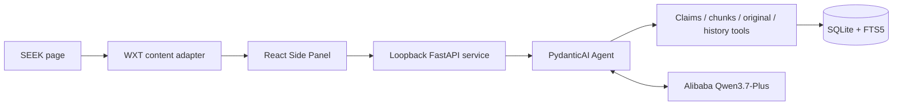

# Kiwi Career Copilot — Project Showcase

> Portfolio snapshot: frozen at the end of V2 Stage 2 for internship applications and interviews. It documents that working milestone, not the current development backlog or a finished commercial release. For the current repository status, see the [project README](../../README.md).

Kiwi Career Copilot is a Chrome extension backed by an AI agent that helps a job seeker understand a role, investigate relevant personal evidence and decide what to do next.

This showcase describes the working product slice completed through Stage 2, not a finished commercial service. The project is driven by my own job search after moving to New Zealand and was tested with real SEEK listings and real career documents before this snapshot was frozen.

## The problem

I arrived in New Zealand as an international student and used SEEK for the first time while looking for part-time work. I had not updated my CV for years and had never needed to write a cover letter in my previous job searches in China. I also had several versions of my CV, visa conditions, a university timetable and project evidence spread across different files.

The difficult part was not generating more text. It was repeatedly answering questions such as:

- Am I actually eligible and available for this role?
- Which of my documents contains evidence for this requirement?
- Is a missing item a real gap, or was it simply omitted from this CV?
- Which questions are important enough to interrupt me?
- What should change for this application without inventing experience?

## What I built

### V1 — SEEK search enhancement

The first version improved the SEEK results page with negative filters, hidden/viewed state and commute-aware filtering. I published it to the Chrome Web Store, which put it in front of real users rather than keeping it as a local demo.

V1 was deliberately simple, but shipping it exposed real browser-extension problems: changing page structures, navigation state, permissions, unclear injected controls and the difference between a feature that works and a product people can understand.

### V2 — Agent and Career Library

V2 keeps the SEEK entry point but introduces a source-first Career Library and a PydanticAI decision agent. A user can add multiple CVs, visa information, a timetable, project documentation and other career sources without rebuilding a manual profile.

The current vertical slice can:

1. Read and validate the current SEEK job.
2. Preserve uploaded originals locally before asking a model to understand them.
3. Build source-bound records and searchable chunks without merging different CVs into one global truth.
4. Give the agent a safe catalogue of available sources rather than every document in full.
5. Let the agent decide which facts to query, which document passages to search, whether to open an original and whether clarification is worth asking.
6. Return a structured recommendation whose candidate findings retain source references.
7. Save completed observations and resume an interrupted or failed analysis instead of starting again.

## Why this is an agent

The application does not run a fixed sequence such as “check visa, then availability, then skills”. Those checks do not apply equally to every job.

The model owns the semantic investigation:

- what matters for the current role;
- which tools and queries to use;
- how deeply to inspect a source;
- whether the available evidence is sufficient;
- whether a user answer could materially change the result;
- when to stop and recommend `APPLY`, `MAYBE` or `SKIP`.

Deterministic software owns the trust boundaries: authentication, input validation, local persistence, sensitive-source handling, provenance, structured output and recovery. It does not contain job-specific `if/else` rules that silently replace the agent's judgement.

## Architecture



The extension handles browser context and interaction. The local service owns private state and the agent runtime. SQLite stores sources, retrieval indexes, analyses and materials. The configured cloud model performs classification, semantic investigation and structured decisions; the API key remains in the local service environment.

## A representative demo

```text
Open a SEEK job
→ start analysis
→ observe which career sources the agent chooses to inspect
→ inspect the source-grounded matches, gaps and unknowns
→ answer a clarification question when it can change the decision
→ continue from the saved observations
→ prepare and open the current application-material preview
```

The UI shows safe tool activity, not hidden chain-of-thought. A failed live model call can also be explained using the saved observation ledger and a sanitised recorded run.

## Technology

- TypeScript, React, WXT and Chrome Manifest V3
- Python, FastAPI, Pydantic and PydanticAI
- Alibaba Qwen3.7-Plus through Model Studio
- SQLite, relational records and FTS5 lexical retrieval
- Vitest, Playwright and Pytest, including local PydanticAI `FunctionModel` contract tests

## Current evidence and limits

The Agent and Library slice has been exercised with multiple purpose-specific CVs, a visa document, a timetable, project Markdown, real SEEK jobs, clarification continuation, sensitive-source retrieval, failure recovery and the first material-generation path.

The project does not claim recommendation accuracy from a synthetic benchmark. Current limitations include lexical rather than semantic retrieval, model-dependent source classification, manual local-service setup, one officially supported model provider, no OCR for image-only PDFs and an early application-material workspace.

## Read next

- [Technical deep dive](technical-deep-dive.md)
- [Current project status and setup](../../README.md)
